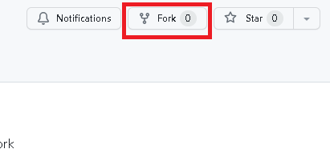
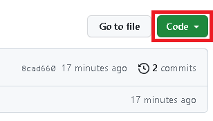

# F23 Python Foundation

This homework aims to simply and guide the way students make their first contribution. To make your first contribution, follow the steps below.



## Fork this repository

Fork this repository by clicking on the fork button on the top of this page. This will create a copy of this repository in your account.

## Clone this repository



Now clone the forked repository to your machine. Go to your GitHub account, open the forked repository, click on the code button and then click the _copy to clipboard_ icon.

Open a terminal and run the following git command:

```
git clone "url you just copied"
```