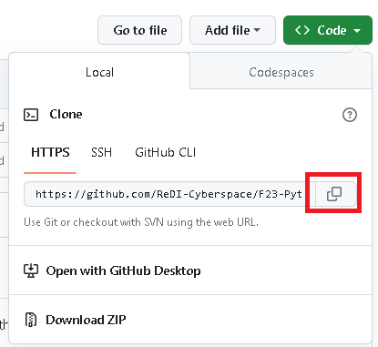

# F23 Python Foundation

This homework aims to simply and guide the way students make their first contribution. To make your first contribution, follow the steps below.


## Fork this repository

Fork this repository by clicking on the fork button on the top of this page. This will create a copy of this repository in your account.

## Clone this repository


Now clone the forked repository to your machine. Go to your GitHub account, open the forked repository, click on the code button and then click the _copy to clipboard_ icon.

Open a terminal and run the following git command:

```
git clone "url you just copied"
```

where "url you just copied" (without the quotation marks) is the url to this repository (your fork of this project). See the previous steps to obtain the url.



For example:

```
git clone git@github.com:this-is-you/F23-Python-Foundation.git
```

where `this-is-you` is your GitHub username. Here you're copying the contents of the F23-Python-Foundation repository on Github to your computer.

## Create a branch

Change to the repository directory on your computer (if you are not already there):

```
cd F23-Python-Foundation
```

Now create a branch using the `git switch` command:

```
git switch -c your-new-branch-name
```

For example:

```
git switch -c add-max-mustermann
```

## Make necessary changes and commit those changes

Now open `Contributors.md` file in a text editor, add your name to it. Don't add it at the beginning or end of the file. Put it anywhere in between. Now, save the file.